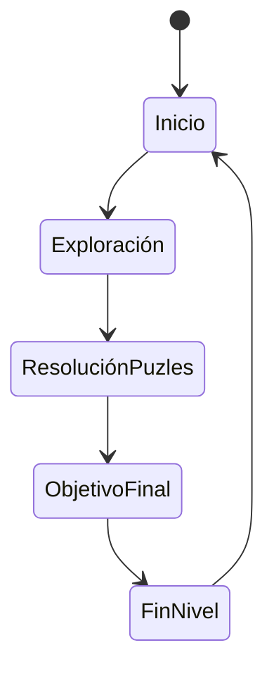
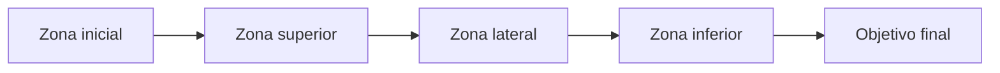
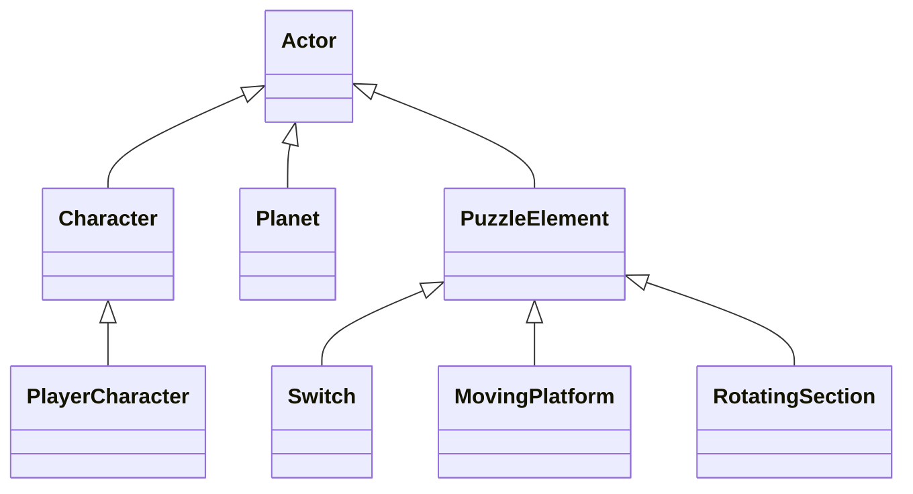

# DEV25-Cabanillas
Repositorio para la practica final de la asignatura DEV del Master de Ingeniería Informática de la UCM
El código y los recursos que no son de terceros se distribuyen bajo la licencia LGPL.

# Descripción

Se trata de un prototipo básico de videojuego de plataformas y puzles en 3D, en el que controlamos a un personaje explorador que recorre planetas. Cada planeta presenta múltiples zonas interconectadas por un sistema de gravedad variable, permitiendo caminar por paredes, techos y superficies curvas.

El núcleo del juego se basa en resolver puzles espaciales que abarcan distintas áreas del planeta, utilizando la gravedad, activando mecanismos y observando el entorno desde diferentes perspectivas, en un estilo similar a Captain Toad combinado con la gravedad planetaria de Super Mario Galaxy.

El prototipo reproduce las mecánicas esenciales de la práctica: exploración en escenarios cerrados pero complejos, interacción con elementos del entorno, puzles encadenados y control preciso del movimiento bajo distintas orientaciones gravitatorias.

El objetivo principal es completar los desafíos del planeta para alcanzar el objetivo final (estrella, artefacto o salida), a traves de la exploración, sistema de gravedad, puzles, interacción con el entorno y progresión del nivel.

# Punto de partida

El punto de partida de este proyecto es una plantilla base de Unreal Engine en tercera persona, modificada para implementar un sistema de gravedad planetaria personalizada.

Esta base proporciona locomoción básica, control de cámara y estructura de nivel, sobre la que se ha construido el sistema de puzles y exploración en superficies curvas.

Opcionalmente se emplean recursos del Starter Content y otros paquetes para el prototipado rápido de escenarios, mecanismos y elementos interactivos.

# Instalación y uso

Los ficheros más importantes del proyecto están disponibles en este repositorio.
Para descargarlos correctamente se requiere tener activa la extensión Git LFS (Large File Storage) si se utiliza GitHub Desktop o un cliente similar.

Algunos recursos externos se descargan desde carpetas compartidas en Google Drive.
[Disponible con acceso general aquí](https://drive.google.com/drive/u/0/folders/1TfoB5S3yQw49-onoFfn0q79PTfk2RoSE).

Estos deben descomprimirse directamente dentro de la carpeta Content, quedando así las carpetas:

- Characters
- Input
- LevelPrototyping

Una vez colocadas estas carpetas dentro de Content, el proyecto estará listo para abrirse y ejecutarse directamente desde Unreal Engine.

# Preproducción

La preproducción del juego se centra en:

Diseñar planetas compactos pero densos en contenido

Definir el sistema de gravedad esférica

Crear puzles que requieran observar y recorrer distintas caras del planeta

Ajustar el control del personaje para garantizar precisión y legibilidad

# Diseño general

El prototipo presenta un único planeta principal, dividido en varias zonas conectadas por caminos, rampas, plataformas móviles y cambios de orientación gravitatoria.

Los puntos clave del diseño son:

Planeta explorable – escenario planetario donde todas las superficies son transitables.

Sistema de gravedad – el personaje se adhiere a la superficie más cercana, cambiando la orientación de la cámara y el movimiento.

Puzles interconectados – mecanismos que afectan a varias zonas del planeta (puentes, interruptores, rotaciones).

Exploración sin combate – enfoque en observación, lógica y movimiento preciso.

# Estética

El estilo visual es colorido y limpio, con formas simples y contrastes claros para facilitar la lectura espacial del planeta y los puzles.

Los materiales y geometría están pensados para distinguir fácilmente caminos, zonas peligrosas y elementos interactivos.

# Gráficos

Planeta con iluminación global dinámica.

Superficies curvas claramente delimitadas.

Elementos interactivos resaltados visualmente.

HUD mínimo mostrando:

Coleccionables

# Dinámica

El jugador explora el planeta observando su geometría desde múltiples ángulos.
Al activar mecanismos o mover objetos, se desbloquean nuevas rutas que pueden encontrarse en zonas opuestas del planeta.

El cambio constante de orientación obliga al jugador a reinterpretar el espacio, siendo clave para resolver los puzles más complejos.

## Flujo de juego

# Objetivo

Completar el planeta resolviendo todos los puzles necesarios para alcanzar el objetivo final, recogiendo opcionalmente coleccionables ocultos para un mayor porcentaje de completado.

# Castigo

No existe muerte tradicional.
Los errores de posicionamiento o lógica devuelven al jugador al último punto seguro, fomentando la experimentación sin penalización excesiva.

# Mecánica
## Avatar

Personaje en tercera persona.

Movimiento libre sobre superficies curvas.

Cámara adaptativa a la gravedad local.

Interacción con objetos mediante un botón dedicado.

## Sistema de gravedad

Gravedad orientada hacia el centro del planeta.

Transiciones suaves entre superficies.

Reorientación automática de cámara y controles.

Posibilidad de puzles basados en cambios de orientación.

## Puzles

Interruptores de presión.

Plataformas móviles.

Rotaciones de secciones del planeta.

Activación remota de mecanismos visibles desde otras zonas.

## Contenido

Nivel principal – Planeta de prueba

Incluye:

Varias zonas interconectadas

Mecanismos de activación

Rutas alternativas

Coleccionables opcionales

# Producción

Las tareas se han repartido entre los autores.

Estado	Tarea	Fecha
Diseño: Concepto del planeta		
Niveles: Prototipado del escenario		
Mecánicas: Sistema de gravedad		
Mecánicas: Interacción con puzles		
Cámara y control		
UI: HUD mínimo		
QA: Pruebas de navegación		
Mecánicas implementadas

[] Movimiento en superficies curvas
[] Sistema de gravedad planetaria
[] Puzles interconectados
[] Cámara adaptativa
[] Interacción con mecanismos

Pulido visual
Pulido de sonido
Optimización del control

Clases principales

# Licencia

Los autores de la documentación, código y recursos de este trabajo conceden permiso permanente a los profesores de la Facultad de Informática de la Universidad Complutense de Madrid para utilizar nuestro material con fines educativos o de investigación, reconociendo expresamente nuestra autoría.

Una vez superada con éxito la asignatura, se prevé publicar todo en abierto:

Documentación bajo licencia Creative Commons Attribution 4.0 International (CC BY 4.0)

Código bajo licencia GNU Lesser General Public License 3.0 (LGPL)

# Referencias

Captain Toad: Treasure Tracker

Super Mario Galaxy

Unreal Engine – Third Person Template

Recursos modulares para prototipado 3D

# Enlace vídeo

[Enlace]()
